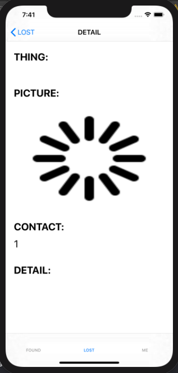

# FIND
```
在校期间看到很多同学都在丢学生卡或是其他什么东西，各种在朋友圈里挂寻物启事/失物招领。

我觉得这样的寻找方式太过繁琐，而且扩散的速度没有那么快，所以想做一个解决这个问题的应用。

在这个应用中，大家可以上传寻物启事/失物招领，并根据应用中提供的信息进行联系。

当前进度只来到了做好了大概的iOS端的框架，后端的搭建以及功能的完善还等待进一步完成。
```

### 简介

> 用户无论是想寻找丢失物品或是捡到丢失物品寻找失主，都可以在应用中发布信息。接着大家就可以在信息页中找寻自己所需要的信息。

### TODO

> - 样式调整的好看一些
> - 使用动画来让loading图片转起来，提升用户体验
> - cell的点击似乎有不对应的问题，需要观察一下
> - 更换头像加入拍照功能
> - UITableView还需要进一步提升流畅度，待使用真机测试
> - 进入app时，是否能使用一个引导页面，等待app初始化完毕。
> - 使用模拟器与真机有差异

### 2.23更新
```
完成了设置头像的功能，但苦于没有云可以存储图片。所以用户更换图片的时候都是用一个统一的网络图片进行代替。

加载图片的时候，若是用户没有选择头像，或是选择了头像而本地无缓存。则第一时间将头像换成loading.png图像

接着，若是用户选择了头像，则通过用户信息中头像的url在子线程中下载图片，完成后在主线程更新图片。
```
### 2.27更新
```
由于没有云，开发很难开展。所以这几天倒腾了一下腾讯云。通过上面的入门教程，终于能把图片上传到云端了。

那么接下来寻物启事、失物招领页也可以做了。之前由于cell中要显示头像，一直没有开始做，应该过几天就可以完成了。
```
### 3.1更新
```
完成了发帖页面设计，其中实现了单选框，带placeholder的UITextView。

发帖的数据交互还没有做，大概明天可以完成
```
### 3.2更新
```
基本完成了整个应用的设计。在UITableview的图片加载中，实现了异步下载，主线程更新的功能。

并且添加了cell点击后的详情页，同样使用的是上述的图片加载策略。

待完成的还有搜索框，以及上拉加载，下拉更新的功能。
```
### 3.3更新
```
今天给app加入了搜索栏以及下拉刷新的功能。上拉加载的功能似乎需要后端的密切配合，暂时没有想好怎么实现。

其中，搜索栏自己做了一些扩展。个人认为在键盘上的searchBtn使用起来不太友好，所以我在UISearchBar旁边添加了一个Btn

并为其添加点击事件，进行搜索。

值得一提的是，UISearchBar中的SearchTextfield似乎不能直接从中读取字符串。我的实现思路是，在监测textfield变动的代理函数中，

将监测到的值赋值给当前VC的实例变量，那么当我们点击按钮需要获取搜索内容时，就可以直接使用VC的实例变量了。

另外，原本想将这个带Btn的UISearchBar封装成自己的一个组件，但是出现了一个问题：

在添加该自定义组件的VC中无法为其中的Btn设置Target-action

所以最终没能做成，具体是为什么绑定失败，还需要进一步实验理解。

```


### 页面

-----

#### 登陆页面 & 注册页面

> | 登陆页面                                                     | 注册页面                                                     |
> | ------------------------------------------------------------ | ------------------------------------------------------------ |
> |  |  |
>
> 这两个页面设计比较简单，就只是简单得UI空间堆叠即可。
>
> **程序逻辑：**
>
> AppDelegate使用KVO监听其属性User。
>
> 当用户注册或是登陆时，当获得服务端成功消息后，就会设置User。此时AppDelegate监听到User的值不为nil时，就将其window的rootViewController设置为实际使用页面。
>
> 当用户退出时，User将被置为nil，此时AppDelegate监听到User为nil值，便将window的rootViewController设置为登陆页面。


#### 个人信息页面

> | 个人信息页                                                   | 更换头像                                                     |
> | ------------------------------------------------------------ | ------------------------------------------------------------ |
> |  |  |
>
> 这个页面设计同样比较简单，将用户信息填在对应的信息栏中即可。值得一提的是，这个页面实现了从图库更换头像的功能，相机拍照功能由于使用模拟器会报错，所以暂时没有做。
>
> **程序逻辑：**
>
> 当用户更换头像时，将所选图片存入缓存，并将其上传云端，同时更新数据库中用户的头像名称。而图片的名字使用 `用户名_portrait` 进行标识，由于用户名唯一且不含特殊字符，那么图片名也唯一，这样做就可以唯一的在本地或是云端标识一张用户的头像。
>
> 当用户登录时，（若用户还未设置头像则跳过下述步骤）首先查看缓存中有没有其头像缓存，有的话直接换上。否则先将其头像置为等待样式，接着通过 `云地址+头像名称`  下载其头像，并将下载后的头像换上，并写入缓存。
>
> 另外，该页面同样使用KVO监听用户信息。当用户信息改变时，该页面会对应的改变其信息栏。


#### 失物招领 & 寻物启事简介页（两个页面实现方式一致）

> | LOST                                                         | FOUND                                                        |
> | :----------------------------------------------------------- | ------------------------------------------------------------ |
> |  |  |
>
> 该页面实现了 **帖子简介、搜索栏、发布按钮** 3个组件。
>
> 同时还实现了 **下拉更新** 的功能， **上拉加载** 功能由于需要后端的密切配合，暂时没有想好后端应该怎么实现，所以暂时还没有做。
>
> - **帖子简介**
>
>   该组件就是一个UITableView，其中cell使用了自定义的cell，cell中包含了东西的名字，联系电话，发布者头像以及日期，都是简单的UI控件。而该页面将维护一个NSMutableArray，用于提供UITableView信息，完成datasource的功能。点击cell可以进入帖子详情，该页面将会在后面提及。
>
> - **搜索栏**
>
>   搜索栏的实现比较有意思。我查看微信的搜索栏，发现它是监测用户输入的每一个字符，并实时给出返回信息。而搜索的这个步骤，我目前只想到得是遍历整一个数据数组，找到所有包含搜索信息的数据并返回。这显然是一种十分低效的搜索行为。如果当用户每输入一个字符都要做一次这样的遍历，那么耗费的资源将十分大。另外，其实用户在搜索的时候，实际搜索的应该是其停止输入后所键入的内容。所以为了提高运行效率，我决定使用一个按钮来作为搜索的启动方式。
>
>   通过查询UISearchBar的信息，我了解到苹果提供的UISearchBar中的确定按钮是被嵌入在输入键盘中的。我个人认为这是一种体验较差的设计。 **因为键盘作为一种输入工具，我只希望利用其来输入一些字符，而并不希望通过它来与页面交互，** 在我日常使用中，我也是只会对着键盘的字符键一顿输出，而不会留意到其确认键是否变成了“搜索”的功能。所以我决定将按钮放在搜索栏的旁边。
>
>   那么我就重新设计了一个UIView，其中包含一个UISearchBar和一个UIButton。接着要做的事情就是为UIButton绑定事件了。可能是由于iOS版本的问题，SearchTextField似乎只支持iOS13之后的版本，导致我无法直接通过UISearchBar提取出搜索栏里键入的内容。不过这也没有关系，我们可以通过UISearchBar的代理方法监测键入内容的变化，再重新设置一个实例变量用于储存键入内容，这样在我设计UIButton点击事件的时候就可以直接取到键入内容了。
>
>   在获得实际搜索结果后，我们就可以通过将UITableView所依赖的数据数组设置为搜索结果数组，然后reloadData，就可以更新显示内容了。
>
>   而当用户需要恢复初始页面内容的时候，我们还是需要在UISearchBar的代理方法中监控输入内容，当输入框内容为空时，就将UITableView的内容设置为初始数组，接着reloadData即可。
>
> - **发布按钮**
>
>   发布按钮比较简单，点击后就会进入发布页面。
>
> 此外，在该页面的图片加载中，我做了一个简单的类似于SDWebImage的优化。就是在所有图片都没有缓存的时候，通过异步下载头像，并在下载完成后写缓存并更新图片。值得一提的是，所有的图片下载都会被我加入到一个名为ImageQueue的线程队列中，当用户滑动页面的时候，我会将队列中的所有操作取消，以此来适应cell复用的机制，同时也稍微的提升了流畅度。


#### 帖子详情页面

> | 图片加载中                  | 图片加载完成                                                 |
> | --------------------------- | ------------------------------------------------------------ |
> |  |  |
>
> 该页面设计比较简单，图片下载仍是上文提到的思路。


#### 帖子发布页面

> | 初始状态                                                     | 完成状态                                                     |
> | ------------------------------------------------------------ | ------------------------------------------------------------ |
> |  |  |
>
> 该页面主要有两个比较有新意的地方： **单选框，带placeholder的UITextView**
>
> - **单选框**
>
>   苹果似乎没有给我们设计好的单选框供我们直接使用，所以这里只好自己实现一个。
>
>   **实现思路：**
>
>   首先需要自己p两张图，分别是选中状态和未选中状态，接着通过给按钮加入点击事件，对应的改变其图片，以完成单选框的实现。
>
> - **带placeholder的UITextView**
>
>   苹果似乎只给UITextField做了placeholder，而UITextView则没有，所以这里我们也是通过设置一个UILabel作为placeholder，并监测UITextView的键入内容，当用户开始输入时，将UILabel隐藏；当用户停止输入的时候检测其中键入内容的长度，若为0则将UILabel显示。

